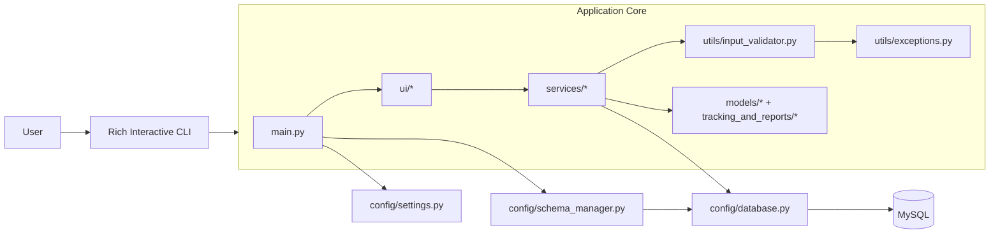
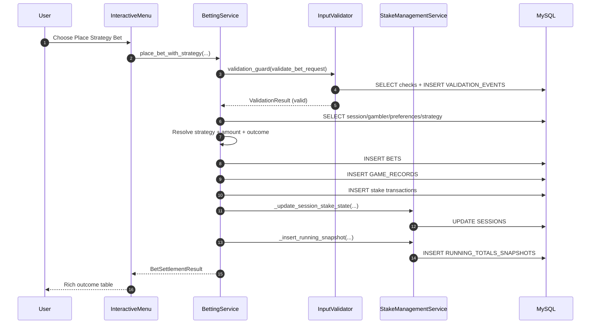
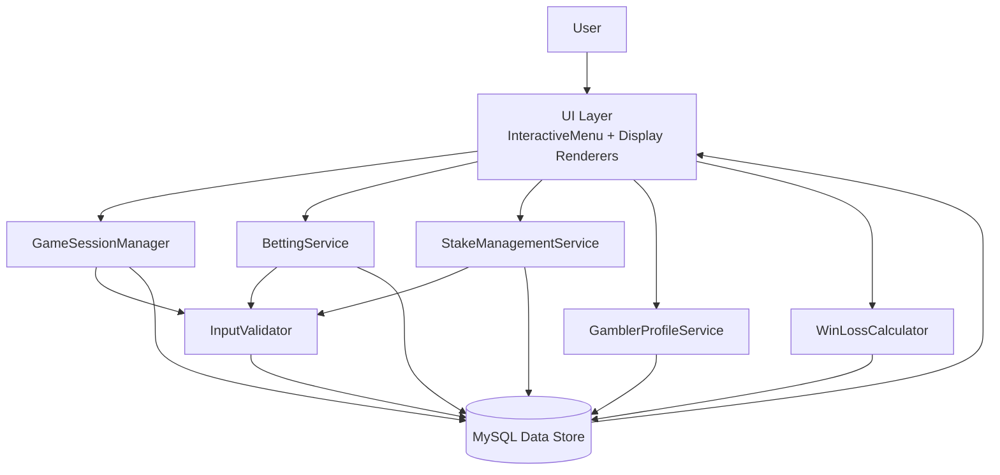
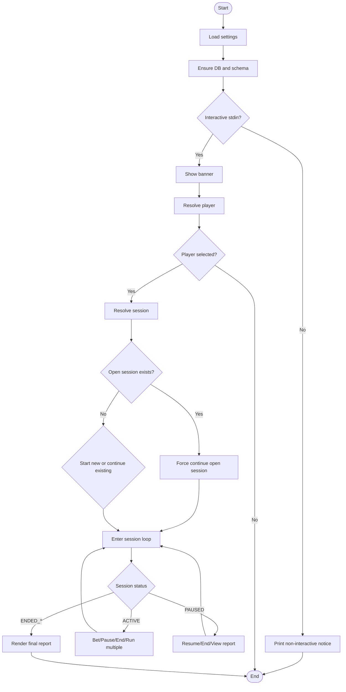
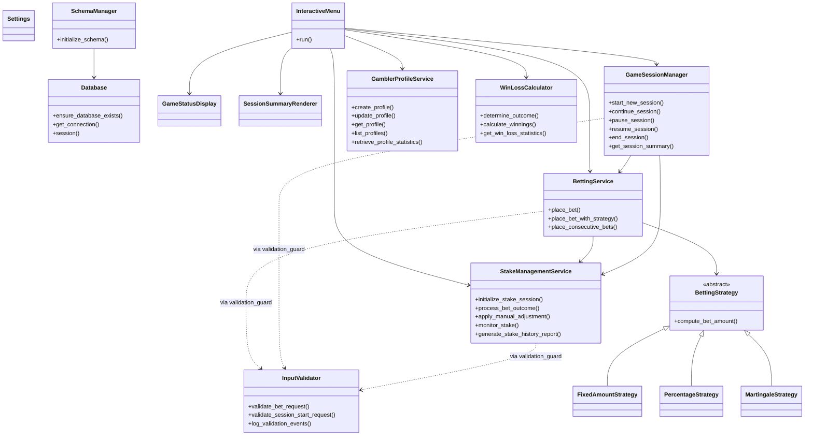
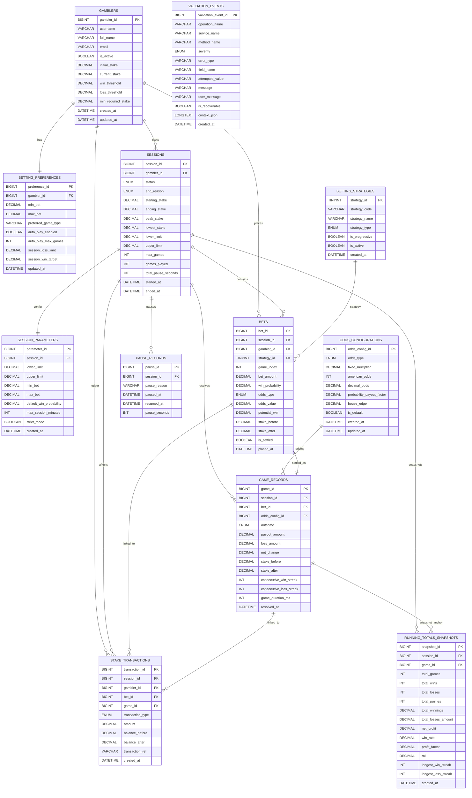

# Gambling App

A production-style, service-oriented Python application for interactive gambling session management, odds-driven bet settlement, stake lifecycle tracking, validation auditing, and rich terminal reporting.

This README is intentionally comprehensive for two goals:
- Help any engineer quickly understand the system at a business and technical level.
- Enable safe collaboration by documenting architecture, data model, control flow, and function-level behavior.

## Table of Contents
- [1. Executive Summary](#1-executive-summary)
- [2. Business Capabilities](#2-business-capabilities)
- [3. Technology Stack](#3-technology-stack)
- [4. Quick Start](#4-quick-start)
- [5. Configuration Reference](#5-configuration-reference)
- [6. Runtime Modes](#6-runtime-modes)
- [7. Architecture Overview](#7-architecture-overview)
- [8. High-Level Design (HLD) Diagram](#8-high-level-design-hld-diagram)
- [9. Low-Level Design (LLD) Diagram](#9-low-level-design-lld-diagram)
- [10. Data Flow Diagram](#10-data-flow-diagram)
- [11. Activity Diagram](#11-activity-diagram)
- [12. Class Diagram](#12-class-diagram)
- [13. Entity-Relationship (ER) Diagram](#13-entity-relationship-er-diagram)
- [14. Database Table Semantics](#14-database-table-semantics)
- [15. Python Concepts Used in This Codebase](#15-python-concepts-used-in-this-codebase)
- [16. File-by-File Function Catalog](#16-file-by-file-function-catalog)
- [17. Cross-Module Collaboration and Control Flow](#17-cross-module-collaboration-and-control-flow)
- [18. Service-to-Database Interaction Map](#18-service-to-database-interaction-map)
- [19. Collaboration Guide](#19-collaboration-guide)
- [20. Known Caveats and Engineering Notes](#20-known-caveats-and-engineering-notes)
- [21. Extension Playbooks](#21-extension-playbooks)

## 1. Executive Summary
The Gambling App is a layered Python system that separates:
- Configuration and database concerns.
- Domain and reporting models.
- Business services (session, betting, stake, profile, analytics).
- Input validation and exception taxonomy.
- Rich terminal user interaction and report rendering.

Core characteristics:
- Uses MySQL with explicit SQL and transaction boundaries.
- Uses Decimal-based financial arithmetic.
- Uses decorator-based validation with centralized validation logging to a database audit table.
- Uses strategy pattern for bet sizing (manual/fixed/percentage/martingale).
- Provides live and end-of-session rich console reporting.

## 2. Business Capabilities
- Player profile lifecycle:
  - Create and update gamblers and betting preferences.
  - Validate eligibility for session participation.
- Session lifecycle management:
  - Start, pause, resume, continue, and end sessions.
  - Enforce one-open-session policy per gambler.
- Betting operations:
  - Manual and strategy-driven bets.
  - Consecutive game execution.
  - Probabilistic outcome determination with configurable odds behavior.
- Stake and boundary management:
  - Track stake changes and transaction history.
  - Detect warning zones and hard boundary crossing.
- Reporting and analytics:
  - Running totals snapshots.
  - Session win/loss KPIs and profile-level aggregate statistics.
  - Rich final report at session closure.
- Validation and audit:
  - Structured validation warnings/errors.
  - Persistent validation event records for observability.

## 3. Technology Stack
- Language: Python 3.14.x
- Database: MySQL
- DB Driver: mysql-connector-python
- Console UI: rich
- Config Loading: python-dotenv
- Formatting and markdown rendering deps:
  - markdown-it-py
  - mdurl
  - Pygments
  - typing_extensions

Dependencies (from requirements.txt):
- markdown-it-py==4.0.0
- mdurl==0.1.2
- mysql-connector-python==9.6.0
- Pygments==2.20.0
- python-dotenv==1.2.2
- rich==15.0.0
- typing_extensions==4.15.0

## 4. Quick Start
### Prerequisites
- Python 3.14+
- MySQL running and reachable
- A user with permission to create/use the target database

### Installation
```powershell
python -m venv .venv
.\.venv\Scripts\Activate.ps1
pip install -r requirements.txt
```

### Environment setup
```powershell
Copy-Item .env.example .env
```
Then edit `.env` values for your environment.

### Run
```powershell
python .\main.py
```

## 5. Configuration Reference
Environment variables recognized by `config/settings.py`:

| Variable | Type | Default | Required | Notes |
|---|---|---|---|---|
| APP_NAME | string | Gambling App | no | App display name |
| APP_ENV | string | dev | no | Environment label |
| APP_DEBUG | bool | false | no | Debug switch |
| DB_HOST | string | - | yes | MySQL host |
| DB_PORT | int | 3306 | no | MySQL port |
| DB_NAME | string | - | yes | Database name |
| DB_USER | string | - | yes | DB username |
| DB_PASSWORD | string | - | yes | DB password |
| DB_CHARSET | string | utf8mb4 | no | DB charset |
| DB_AUTOCOMMIT | bool | false | no | Connector autocommit |
| SESSION_DEFAULT_WIN_PROBABILITY | decimal | 0.50 | no | Range [0,1] |
| SESSION_DEFAULT_MAX_GAMES | int | 100 | no | Positive integer |
| SESSION_DEFAULT_MAX_MINUTES | int | 120 | no | Positive integer |
| VALIDATION_STRICT_MODE | bool | true | no | Strict validation behavior |
| MIN_INITIAL_STAKE | decimal | 100.00 | no | Lower stake guardrail |
| MAX_INITIAL_STAKE | decimal | 1000000.00 | no | Upper stake guardrail |

Validation rule at load time:
- MIN_INITIAL_STAKE must be <= MAX_INITIAL_STAKE.

## 6. Runtime Modes
- Interactive mode:
  - Trigger: `sys.stdin.isatty()` is true.
  - Behavior: Starts `InteractiveMenu` flow.
- Non-interactive mode:
  - Trigger: no TTY input.
  - Behavior: Initializes config/db/schema then exits after informational notice.

## 7. Architecture Overview
Layered architecture:
- Entry and bootstrap:
  - `main.py`
- Infrastructure and config:
  - `config/settings.py`, `config/database.py`, `config/schema_manager.py`
- Domain models:
  - `models/*`, `tracking_and_reports/*`
- Business services:
  - `services/*`
- Validation and errors:
  - `utils/input_validator.py`, `utils/exceptions.py`
- UI and rendering:
  - `ui/interactive_menu.py`, `ui/game_status_display.py`, `ui/session_summary.py`

Primary architectural patterns:
- Service layer pattern
- Strategy pattern
- Decorator-based cross-cutting validation
- DTO-style dataclass models
- Transaction script style for explicit SQL workflows

## 8. High-Level Design (HLD) Diagram


## 9. Low-Level Design (LLD) Diagram


## 10. Data Flow Diagram


## 11. Activity Diagram


## 12. Class Diagram


## 13. Entity-Relationship (ER) Diagram


## 14. Database Table Semantics
- GAMBLERS:
  - Core identity and stake thresholds.
- BETTING_PREFERENCES:
  - Per-gambler wagering and auto-play settings.
- SESSIONS:
  - Session lifecycle state and boundary controls.
- SESSION_PARAMETERS:
  - Session execution-time parameter snapshot.
- BETTING_STRATEGIES:
  - Registry of strategy codes and metadata.
- ODDS_CONFIGURATIONS:
  - Odds and payout configuration definitions.
- BETS:
  - Individual bet intents before and after settlement.
- GAME_RECORDS:
  - Outcome-level records for each settled bet.
- PAUSE_RECORDS:
  - Pause/resume timeline with duration accumulation.
- STAKE_TRANSACTIONS:
  - Stake ledger for every stake-impacting event.
- RUNNING_TOTALS_SNAPSHOTS:
  - Cumulative statistical snapshots across session progress.
- VALIDATION_EVENTS:
  - Validation audit trail for operation-level diagnostics.

## 15. Python Concepts Used in This Codebase
All major Python concepts used in this repository are listed below with concrete examples.

### Core language and typing
- Future annotations:
  - `from __future__ import annotations` is used broadly for forward reference typing.
- Type hints and generics:
  - Extensive use of `Any`, `Mapping`, `Optional`, `tuple[...]`, `dict[...]`, `Iterator[...]`.
- Union syntax:
  - Modern `X | Y` unions across services and validators.
- Slots and immutability:
  - Dataclasses with `slots=True` and many with `frozen=True`.

### Object-oriented and behavioral patterns
- Dataclasses:
  - DTOs in `models/*` and `tracking_and_reports/*`.
- Enums:
  - Domain enums in `models/stake_management.py` and validation enums in `utils/exceptions.py`.
- Abstract base classes:
  - `BettingStrategy` in `strategies/base_strategy.py`.
- Strategy pattern:
  - `FixedAmountStrategy`, `PercentageStrategy`, `MartingaleStrategy` selected by `BettingService`.
- Dependency injection:
  - Services receive `Database`, `Settings`, and optional collaborator instances.

### Functional and meta-programming constructs
- Decorators:
  - `validation_guard` applies pre-execution validation and audit behavior.
- Closures:
  - Nested decorator functions in `utils/input_validator.py`.
- Lazy imports:
  - `utils/__init__.py` uses `__getattr__` for deferred symbol loading.
- TYPE_CHECKING gate:
  - Avoids runtime import cycles while preserving static typing support.

### Resource and error handling
- Context managers:
  - `Database.session` provides transactional unit boundaries.
- Exception wrapping:
  - SQL/config failures wrapped into domain-level exceptions.
- Structured validation model:
  - `ValidationException`, `ValidationIssue`, `ValidationResult`.
- Recovery-aware validation:
  - Severity and recoverability used for user-facing feedback logic.

### Numerical correctness
- Decimal-first financial arithmetic:
  - Monetary and rate parsing/quantization avoids float drift.
- Controlled quantization:
  - `ROUND_HALF_UP` applied in monetary and probability normalization paths.

### SQL and persistence practices
- Parameterized queries:
  - SQL placeholders consistently used for data values.
- Explicit commit/rollback boundaries:
  - Service methods commit at meaningful business transaction completion points.
- Selective row locking:
  - `FOR UPDATE` used where race-sensitive updates occur.

## 16. File-by-File Function Catalog
This section describes every first-party Python file, including classes, functions, and methods.

### 16.1 Root
#### `main.py`
- `bootstrap() -> tuple[Database, Settings]`:
  - Loads settings from environment, initializes database and schema/seed state, prints startup status, and returns dependencies.
- `main() -> None`:
  - Runs bootstrap, launches `InteractiveMenu` in interactive mode, handles `SettingsError` and generic startup failures with clean process exit.

### 16.2 Config package
#### `config/__init__.py`
- Re-export module for:
  - `Database`, `SchemaManager`, `Settings`, `SettingsError`, `load_settings`.

#### `config/database.py`
- `class Database`:
  - DB wrapper around mysql connector with safe connection/session lifecycle.
- `__init__(settings)`:
  - Stores immutable runtime settings.
- `_validate_identifier(value, field_name)`:
  - Regex-validates SQL identifiers (DB name/charset) and raises `DataAccessException` on invalid values.
- `_connection_args(include_database)`:
  - Produces connector kwargs with optional database target.
- `ensure_database_exists()`:
  - Creates configured database if missing using connection without selected DB.
- `get_connection()`:
  - Opens a configured DB connection.
- `session(dictionary=False)`:
  - Context-managed transaction/cursor boundary with rollback-on-error and guaranteed cleanup.

#### `config/schema_manager.py`
- `class SchemaManager`:
  - Owns schema creation and seed insertion.
- `__init__(database)`:
  - Stores `Database` dependency.
- `initialize_schema()`:
  - Ensures DB existence, executes all DDL statements, executes seed upserts, commits.
- `_schema_statements()`:
  - Returns all create-table SQL statements.
- `_seed_statements()`:
  - Returns strategy and odds baseline upsert SQL statements.

#### `config/settings.py`
- `class SettingsError(ValueError)`:
  - Configuration validation exception.
- `@dataclass(frozen=True, slots=True) class Settings`:
  - Holds all app/DB/session/validation configuration.
- `_load_env_once()`:
  - One-time `.env` loading from project root or legacy config folder.
- `_required_str(name)`:
  - Required non-empty string env reader.
- `_optional_str(name, default)`:
  - Optional string env reader with fallback default.
- `_bool(name, default)`:
  - Boolean parser for common true/false tokens.
- `_int(name, default=None, min_value=None)`:
  - Integer parser with optional default and lower-bound validation.
- `_decimal(name, default=None, min_value=None, max_value=None)`:
  - Decimal parser with range validation.
- `load_settings()`:
  - Constructs `Settings` from env vars + defaults and validates stake bound consistency.

### 16.3 Models package
#### `models/__init__.py`
- Re-export module for all domain model symbols.

#### `models/betting.py`
- `BetConfirmation`:
  - DTO for placed bet acknowledgment.
- `BetSettlementResult`:
  - DTO for settled game result and stake/session state.
- `ConsecutiveBetSummary`:
  - DTO for batch run aggregate outcomes.

#### `models/gambler_profile.py`
- `GamblerProfile`:
  - Mutable profile model with identity and stake thresholds.
- `BettingPreferences`:
  - Mutable preference model for min/max bets, game type, and auto-play limits.

#### `models/session_models.py`
- `SessionParameters`:
  - DTO for persisted session parameter record.
- `PauseRecord`:
  - DTO for pause interval history row.
- `SessionLifecycleState`:
  - DTO for stateful lifecycle fields.
- `SessionDurationMetrics`:
  - DTO for total/active/pause durations.
- `SessionSummary`:
  - Aggregate DTO combining lifecycle, parameters, durations, stake KPIs, and outcomes.
- `SessionListItem`:
  - Lightweight DTO for session listings.
- `SessionContinuationResult`:
  - DTO for batch session continuation results.

#### `models/stake_management.py`
- `TransactionType` enum:
  - Ledger event taxonomy (initial/bet/deposit/withdrawal/adjustment/reset).
- `SessionStatus` enum:
  - Session states from initialization to closed variants.
- `SessionEndReason` enum:
  - Semantic closure reasons.
- `StakeBoundary`:
  - Boundary holder with warning threshold properties.
- `StakeBoundary.warning_lower`:
  - Computes lower warning threshold.
- `StakeBoundary.warning_upper`:
  - Computes upper warning threshold.
- `StakeTransaction`:
  - DTO for stake transaction ledger item.
- `RunningTotalsSnapshot`:
  - DTO for cumulative snapshot metrics.

### 16.4 Strategies package
#### `strategies/__init__.py`
- Re-export module for strategy context/base and concrete strategies.

#### `strategies/base_strategy.py`
- `StrategyContext`:
  - Carries game index and previous bet context for strategy computation.
- `BettingStrategy(ABC)`:
  - Abstract strategy contract.
- `compute_bet_amount(...)`:
  - Abstract method requiring implementations to return bet size.

#### `strategies/fixed_amount_strategy.py`
- `FixedAmountStrategy`:
  - Fixed-size bet strategy.
- `__init__(amount)`:
  - Stores configured fixed amount.
- `compute_bet_amount(...)`:
  - Returns fixed amount capped by current stake.

#### `strategies/percentage_strategy.py`
- `PercentageStrategy`:
  - Percentage-of-stake strategy.
- `__init__(percent)`:
  - Stores fraction for sizing.
- `compute_bet_amount(...)`:
  - Computes percentage amount, quantizes, applies minimum tiny floor behavior, caps by stake.

#### `strategies/martingale_strategy.py`
- `MartingaleStrategy`:
  - Progressive doubling strategy.
- `__init__(base_amount)`:
  - Stores base amount.
- `compute_bet_amount(...)`:
  - Doubles after a loss based on prior amount/outcome, otherwise uses base, then caps by stake.

### 16.5 Tracking and Reports package
#### `tracking_and_reports/__init__.py`
- Re-export module for report dataclasses.

#### `tracking_and_reports/gambler_statistics.py`
- `GamblerStatistics`:
  - Profile-level aggregate KPI DTO.
- `EligibilityStatus`:
  - DTO describing if profile can start session and why/why not.

#### `tracking_and_reports/stake_history_report.py`
- `StakeHistoryItem`:
  - One transaction timeline item.
- `StakeBoundaryValidation`:
  - Boundary state and warnings DTO.
- `StakeMonitorSummary`:
  - Stake posture and volatility summary DTO.
- `StakeHistoryReport`:
  - Full stake history report aggregate DTO.

#### `tracking_and_reports/win_loss_statistics.py`
- `OddsConfiguration`:
  - Odds configuration DTO.
- `RunningTotalsByGame`:
  - Per-snapshot cumulative KPI DTO.
- `WinLossStatistics`:
  - Session-level win/loss analytics DTO.

### 16.6 Utils package
#### `utils/__init__.py`
- `__getattr__(name)`:
  - Lazy-loads validator symbols (`InputValidator`, `get_last_validation_result`, `validation_guard`) to avoid eager import cycles.
- Also re-exports exception and validation types.

#### `utils/exceptions.py`
- `ValidationErrorType` enum:
  - Error categories for stake/bet/limit/probability/numeric/range/null.
- `ValidationSeverity` enum:
  - WARNING or ERROR.
- `ValidationException` dataclass:
  - Rich validation exception with typed metadata and user-facing text.
- `ValidationException.__str__()`:
  - Standardized severity/type/field/value formatting.
- `ValidationException.to_issue()`:
  - Converts exception payload into immutable issue DTO.
- `ValidationIssue` dataclass:
  - Immutable representation of one validation finding.
- `ValidationIssue.to_exception()`:
  - Converts issue DTO back into exception object.
- `ValidationResult` dataclass:
  - Validation aggregate for one operation.
- `ValidationResult.is_valid`:
  - True when no ERROR-level issues.
- `ValidationResult.has_warnings`:
  - True when WARNING-level issues exist.
- `ValidationResult.errors`:
  - Filters ERROR-level issues.
- `ValidationResult.warnings`:
  - Filters WARNING-level issues.
- `ValidationResult.first_error`:
  - Convenience accessor for first error.
- `ValidationResult.feedback_messages(include_warnings=True)`:
  - Returns user-facing messages from issues.
- `NotFoundException`:
  - Missing entity exception.
- `DataAccessException`:
  - DB access wrapper exception.

#### `utils/input_validator.py`
- `validation_guard(operation_name, validator_method)`:
  - Decorator factory for pre-execution validation and validation event logging.
- `validation_guard.decorator(function)`:
  - Signature-preserving wrapper creator.
- `validation_guard.decorator.wrapper(*args, **kwargs)`:
  - Resolves validator, validates payload, persists validation events, blocks on invalid payload, otherwise executes function.
- `get_last_validation_result(service_instance)`:
  - Returns last captured validation result if present.
- `class InputValidator`:
  - Central validation engine and validation event logger.
- `InputValidator.__init__(database, settings)`:
  - Stores shared infrastructure dependencies.
- `validate_bet_request(operation_name, payload)`:
  - Validates gambler/session/state/bet/probability/max-games constraints and emits warnings/errors.
- `validate_session_start_request(operation_name, payload)`:
  - Validates profile state, open-session conflicts, limits, stake bounds, and control settings.
- `log_validation_events(result, operation_name, service_name, method_name, payload)`:
  - Persists issue rows (or informational pass row) into `VALIDATION_EVENTS`, intentionally non-blocking on logger failures.
- `_safe_context_json(payload)`:
  - Serializes context payload into durable JSON string.
- `_trim(value, max_length)`:
  - Truncates oversized strings.
- `_to_positive_int(value, field_name, issues)`:
  - Parses positive int and appends validation issue on failure.
- `_to_money(value, field_name, issues)`:
  - Parses Decimal money and appends issue on failure.
- `_to_rate(value, field_name, issues)`:
  - Parses Decimal rate and appends issue on failure.
- `_error_issue(...)`:
  - Factory for ERROR issue DTO.
- `_warning_issue(...)`:
  - Factory for WARNING issue DTO.
- `_resolve_validator(service_instance)`:
  - Creates/reuses validator from service dependencies, fails fast if dependencies are missing.

### 16.7 Services package
#### `services/__init__.py`
- Re-export module for service classes:
  - `BettingService`, `GameSessionManager`, `GamblerProfileService`, `StakeManagementService`, `WinLossCalculator`.

#### `services/betting_service.py`
- `class BettingService`:
  - Main betting transaction orchestrator.
- `__init__(database, settings, stake_management_service=None, rng=None)`:
  - Stores dependencies, sets defaults for stake service and RNG, initializes validation state holder.
- `place_bet(...)`:
  - Decorated manual bet entrypoint; normalizes inputs and delegates to internal execution.
- `place_bet_with_strategy(...)`:
  - Decorated strategy bet entrypoint; resolves strategy-oriented parameters and delegates.
- `place_consecutive_bets(...)`:
  - Executes up to N bets, short-circuits when session is no longer active, returns aggregate summary.
- `determine_bet_outcome(win_probability)`:
  - Bernoulli-style random outcome.
- `_execute_bet(...)`:
  - Full transaction script for validation, amount resolution, bet/game inserts, ledger updates, session state updates, snapshot insertion, and return model creation.
- `_insert_stake_transaction(...)`:
  - Inserts one stake transaction row for this bet context.
- `_fetch_preferences_row(cursor, gambler_id)`:
  - Reads betting preference bounds.
- `_fetch_strategy_row(cursor, strategy_code)`:
  - Reads active strategy metadata.
- `_compute_consecutive_streaks(cursor, session_id, outcome)`:
  - Computes new streak counters based on prior game record.
- `_validate_positive_id(value, field_name)`:
  - Positive integer ID guard.
- `_validate_bet_amount(...)`:
  - Enforces amount and boundary constraints against profile/session/preferences.
- `_normalize_probability(value)`:
  - Probability normalization and bound enforcement.
- `_normalize_multiplier(value)`:
  - Payout multiplier normalization and positivity enforcement.
- `_normalize_strategy_code(strategy_code)`:
  - Strategy code cleanup and emptiness validation.
- `_load_strategy_context(cursor, session_id)`:
  - Loads prior bet context for stateful strategies.
- `_build_strategy(...)`:
  - Constructs concrete strategy instance.
- `_normalize_percentage(value)`:
  - Normalizes percent input forms to decimal fraction.

#### `services/gambler_profile_service.py`
- `_to_money(value, field_name)`:
  - Shared Decimal-money parser for this module.
- `class GamblerProfileService`:
  - Profile and preference management + profile-level analytics.
- `__init__(database, settings)`:
  - Stores dependencies.
- `create_profile(profile, preferences)`:
  - Validates and inserts profile/preferences, logs initial stake transaction, returns persisted profile.
- `update_profile(gambler_id, profile_updates=None, preference_updates=None)`:
  - Whitelist-validates update fields, locks rows, merges normalized updates, persists changes, returns refreshed profile.
- `get_profile(gambler_id)`:
  - Fetches one gambler profile.
- `list_profiles(limit=20)`:
  - Returns recent gamblers with hard cap for safe listing.
- `retrieve_profile_statistics(gambler_id)`:
  - Computes profile-level aggregate KPIs from transaction history.
- `validate_eligibility(gambler_id)`:
  - Builds eligibility status from active flag and stake thresholds.
- `reset_profile_for_new_session(gambler_id, new_initial_stake=None)`:
  - Re-bases initial/current stake and proportionally adjusts thresholds, logs reset transaction.
- `_validate_gambler_id(gambler_id)`:
  - Positive ID guard.
- `_validate_initial_stake(initial_stake)`:
  - Checks against configured min/max stake.
- `_validate_profile(profile, enforce_threshold_position)`:
  - Profile invariant checks.
- `_validate_preferences(preferences)`:
  - Preference invariant checks.
- `_validate_update_fields(updates, allowed_fields, section)`:
  - Unknown-field rejection helper.
- `_normalize_profile(profile)`:
  - Cleans and quantizes profile values.
- `_normalize_preferences(preferences)`:
  - Cleans and quantizes preference values.
- `_profile_from_mapping(mapping)`:
  - DB row to normalized `GamblerProfile`.
- `_preferences_from_mapping(mapping)`:
  - DB row to normalized `BettingPreferences`.
- `_profile_to_db_values(profile)`:
  - Builds update payload dictionary for profile columns.
- `_preferences_to_db_values(preferences)`:
  - Builds update payload dictionary for preference columns.
- `_execute_update(...)`:
  - Dynamic SQL update helper.
- `_fetch_gambler_row(cursor, gambler_id, for_update=False)`:
  - Reads gambler row with optional lock.
- `_fetch_preferences_row(cursor, gambler_id, for_update=False)`:
  - Reads preference row with optional lock.
- `_transaction_ref(prefix, gambler_id)`:
  - Generates unique transaction reference token.

#### `services/game_session_manager.py`
- `class GameSessionManager`:
  - Session lifecycle orchestration and batch continuation coordinator.
- `__init__(database, settings, betting_service=None, stake_management_service=None)`:
  - Initializes dependency graph and shared stake/betting services.
- `start_new_session(...)`:
  - Decorated session start with defaults resolution, open-session guard, inserts to `SESSIONS` and `SESSION_PARAMETERS`, stake alignment, and initial snapshot/transaction.
- `continue_session(...)`:
  - Runs sequence of games while ACTIVE and within timeout constraints.
- `pause_session(session_id, pause_reason=...)`:
  - Creates pause record and marks session paused.
- `resume_session(session_id)`:
  - Closes pause record and restores active state.
- `end_session(session_id, end_reason=...)`:
  - Closes active/paused session and writes ending stake + closure metadata.
- `get_session_lifecycle_state(session_id)`:
  - Reads one lifecycle state.
- `list_sessions(gambler_id=None, include_closed=True, limit=20)`:
  - Returns session listing rows with optional filtering.
- `get_pause_history(session_id)`:
  - Returns pause timeline.
- `get_session_summary(session_id)`:
  - Returns full summary with parameters, durations, and win/loss counts.
- `_is_session_timed_out(session_id)`:
  - Timeout rule based on active duration threshold.
- `_end_as_timeout(session_id)`:
  - Internal timeout closer for active sessions.
- `_assert_no_open_session(cursor, gambler_id)`:
  - Guards one-open-session invariant.
- `_validate_session_inputs(...)`:
  - Validates session start boundaries and controls.
- `_normalize_probability(value)`:
  - Normalizes session default probability.
- `_to_positive_int(value, field_name)`:
  - Positive integer parser.
- `_to_bool(value, field_name)`:
  - Boolean parser.
- `_normalize_end_reason(value)`:
  - End reason normalization and safety conversion.
- `_validate_positive_id(value, field_name)`:
  - Positive ID guard.
- `_lifecycle_from_row(row)`:
  - DB row mapper to lifecycle DTO.
- `_fetch_session_row(cursor, session_id, for_update)`:
  - Session row fetch helper.
- `_fetch_gambler_row(cursor, gambler_id, for_update)`:
  - Gambler row fetch helper.
- `_fetch_preference_row(cursor, gambler_id, for_update)`:
  - Preference row fetch helper.
- `_fetch_open_pause_record(cursor, session_id, for_update)`:
  - Latest open pause fetch helper.
- `_fetch_session_parameters(cursor, session_id)`:
  - Session parameters mapper.
- `_utc_now_naive()`:
  - UTC timestamp helper (naive datetime).

#### `services/stake_management_service.py`
- `_to_money(value, field_name)`:
  - Money parser helper.
- `class StakeManagementService`:
  - Stake ledger and stake-state service.
- `__init__(database, settings)`:
  - Stores dependencies and validation state.
- `initialize_stake_session(...)`:
  - Decorated setup flow for session + stake initialization with transaction and first snapshot.
- `track_current_stake(gambler_id)`:
  - Reads current stake for gambler.
- `process_bet_outcome(...)`:
  - Decorated update flow for bet outcome impact on balances, session state, and snapshots.
- `apply_manual_adjustment(...)`:
  - Applies deposit/withdrawal/adjustment and persists ledger plus session updates.
- `validate_stake_boundaries(session_id)`:
  - Evaluates limit crossing and warning-zone conditions.
- `monitor_stake(session_id)`:
  - Produces stake monitor summary with volatility and boundary status.
- `generate_stake_history_report(session_id, ...)`:
  - Produces transaction timeline and aggregate stake report.
- `_validate_gambler_id(gambler_id)`:
  - Positive ID guard.
- `_validate_session_id(session_id)`:
  - Positive ID guard.
- `_validate_stake_bounds(...)`:
  - Stake boundary rule validation helper.
- `_to_transaction_type(value)`:
  - Transaction enum normalization helper.
- `_fetch_gambler_row(cursor, gambler_id, for_update=False)`:
  - Fetch gambler state subset.
- `_fetch_session_row(cursor, session_id, for_update=False)`:
  - Fetch session state subset.
- `_insert_transaction(...)`:
  - Inserts stake transaction row.
- `_update_session_stake_state(...)`:
  - Updates session peaks/lows/game count and may close session on limit breaches.
- `_insert_running_snapshot(...)`:
  - Aggregates ledger/outcome metrics and inserts running totals snapshot.
- `_transaction_ref(prefix, gambler_id, session_id)`:
  - Transaction reference generator.

#### `services/win_loss_calculator.py`
- `_to_money(value, field_name)`:
  - Money parser helper.
- `class WinLossCalculator`:
  - Outcome and payout math + analytics reader.
- `__init__(database, settings, rng=None)`:
  - Stores deps and random source.
- `determine_outcome(...)`:
  - Computes stochastic win/lose outcome using selected odds mode and optional house edge behavior.
- `calculate_winnings(...)`:
  - Computes payout amount for supported odds types.
- `calculate_loss(...)`:
  - Returns normalized loss amount.
- `list_odds_configurations()`:
  - Returns all configured odds profiles.
- `get_odds_configuration(odds_config_id)`:
  - Returns specific odds profile or not found.
- `get_running_totals_by_game(session_id, include_non_game_snapshots=True)`:
  - Returns running snapshot timeline with game index mapping.
- `get_win_loss_statistics(session_id)`:
  - Returns aggregate win/loss metrics, streaks, ROI, and running timeline.
- `_validate_positive_id(value, field_name)`:
  - Positive ID guard.
- `_normalize_probability(value)`:
  - Probability normalization helper.
- `_normalize_house_edge(value)`:
  - House-edge normalization helper.
- `_normalize_positive_decimal(value, field_name, default=None)`:
  - Positive decimal normalization helper.
- `_odds_row_to_model(row)`:
  - Odds row mapper.
- `_snapshot_row_to_model(row)`:
  - Running snapshot row mapper.

### 16.8 UI package
#### `ui/__init__.py`
- Re-export module for UI classes.

#### `ui/game_status_display.py`
- `class GameStatusDisplay`:
  - Rich console presenter for banner/live status/outcomes/validation messages.
- `__init__(console)`:
  - Stores `rich.console.Console`.
- `show_banner()`:
  - Prints app intro panel.
- `show_profile(profile)`:
  - Displays selected player details table.
- `show_session_status(summary)`:
  - Displays session lifecycle, limits, stake and durations panel.
- `show_bet_outcome(result)`:
  - Displays single bet settlement row set.
- `show_validation_feedback(result)`:
  - Displays validation warnings/errors table.
- `show_info(message)`:
  - Info text emitter.
- `show_warning(message)`:
  - Warning text emitter.
- `show_error(message)`:
  - Error text emitter.
- `_money(value)`:
  - Decimal formatter to 2 places.
- `_rate(value)`:
  - Decimal formatter to 4 places.

#### `ui/interactive_menu.py`
- `class InteractiveMenu`:
  - Primary user journey controller.
- `__init__(database, settings, console)`:
  - Builds service graph and renderers.
- `run()`:
  - Executes setup and session loop orchestrations.
- `_resolve_gambler_id()`:
  - UI loop for create/load/exit profile selection.
- `_create_gambler_profile()`:
  - Prompts and creates profile/preferences.
- `_load_existing_gambler()`:
  - Lists available players then loads selected profile.
- `_resolve_session_id(gambler_id)`:
  - Session setup flow with open-session-first policy.
- `_start_new_session(gambler_id)`:
  - Starts session (default or custom parameters).
- `_use_existing_session(gambler_id, include_closed=True, id_prompt='Enter session ID')`:
  - Lists sessions and attaches selected session with ownership/state checks.
- `_session_loop(gambler_id, session_id)`:
  - Main active/paused action loop until end/exit.
- `_handle_manual_bet(gambler_id, session_id)`:
  - Single manual bet handler.
- `_handle_strategy_bet(gambler_id, session_id)`:
  - Single strategy bet handler.
- `_handle_continue_session(session_id)`:
  - Multi-game continuation handler.
- `_handle_pause(session_id)`:
  - Pause handler.
- `_handle_resume(session_id)`:
  - Resume handler.
- `_handle_end_session(session_id)`:
  - End-session handler.
- `_render_final_report(session_id)`:
  - Gathers and renders end-of-session report.
- `_show_available_players()`:
  - Displays player list table.
- `_show_available_sessions(gambler_id, include_closed=True)`:
  - Displays session list table.
- `_show_validation_feedback(service_instance)`:
  - Pulls and shows service-bound validation result.
- `_display_exception(exc)`:
  - User-facing exception policy mapper.
- `_prompt_text(...)`:
  - Text prompt with non-empty validation.
- `_prompt_int(...)`:
  - Integer prompt with lower-bound validation.
- `_prompt_decimal(...)`:
  - Decimal prompt with optional bounds.

#### `ui/session_summary.py`
- `class SessionSummaryRenderer`:
  - Rich renderer for final session report.
- `__init__(console)`:
  - Stores console dependency.
- `render_end_of_session(...)`:
  - Renders lifecycle, financial, win/loss, running totals and profile-level sections.
- `_money(value)`:
  - Decimal money formatter.
- `_rate(value)`:
  - Decimal rate formatter.

## 17. Cross-Module Collaboration and Control Flow
### Startup and bootstrap
1. `main.main` calls `bootstrap`.
2. `bootstrap` loads settings and initializes database/schema.
3. `SchemaManager.initialize_schema` creates all core tables and seed rows.
4. If terminal is interactive, `InteractiveMenu.run` starts user flow.

### Interactive control loop
1. User selects or creates profile.
2. Session setup checks open sessions first; if one exists, continuation is prioritized.
3. Session actions invoke service methods only (UI does not execute SQL directly).
4. Results are presented through `GameStatusDisplay` and `SessionSummaryRenderer`.

### Validation path
1. Decorated service methods pass through `validation_guard`.
2. Validator produces `ValidationResult` warnings/errors.
3. Invalid operations are blocked on first error.
4. Validation events are logged to `VALIDATION_EVENTS` for auditability.

### Betting and reporting path
1. Menu action calls betting/session service methods.
2. Service writes transactional records and snapshots.
3. End report combines:
   - `GameSessionManager.get_session_summary`
   - `WinLossCalculator.get_win_loss_statistics`
   - `GamblerProfileService.retrieve_profile_statistics`

## 18. Service-to-Database Interaction Map
### BettingService
- Reads: `SESSIONS`, `GAMBLERS`, `BETTING_PREFERENCES`, `BETTING_STRATEGIES`, prior `GAME_RECORDS`/`BETS`.
- Writes: `BETS`, `GAME_RECORDS`, `STAKE_TRANSACTIONS`, `RUNNING_TOTALS_SNAPSHOTS`, updates `GAMBLERS` and `SESSIONS`.

### GamblerProfileService
- Reads/Writes: `GAMBLERS`, `BETTING_PREFERENCES`.
- Analytics reads: `STAKE_TRANSACTIONS` joined with `GAMBLERS`.
- Ledger writes: `STAKE_TRANSACTIONS` for initial/reset events.

### GameSessionManager
- Reads/Writes: `SESSIONS`, `SESSION_PARAMETERS`, `PAUSE_RECORDS`, `GAMBLERS`, `BETTING_PREFERENCES`, `GAME_RECORDS`.
- Also delegates to betting and stake services for continuation and snapshots.

### StakeManagementService
- Reads/Writes: `SESSIONS`, `GAMBLERS`, `STAKE_TRANSACTIONS`, `RUNNING_TOTALS_SNAPSHOTS`.

### WinLossCalculator
- Reads: `ODDS_CONFIGURATIONS`, `SESSIONS`, `GAME_RECORDS`, `BETS`, `RUNNING_TOTALS_SNAPSHOTS`.
- Writes: none.

### InputValidator
- Reads: profile/session/preference state to validate requests.
- Writes: `VALIDATION_EVENTS` audit records.

## 19. Collaboration Guide
### Branching and PR workflow
Recommended enterprise workflow:
1. Create feature branch:
   - `feature/<short-capability-name>`
2. Keep commits small and thematic.
3. Open PR with:
   - Problem statement
   - Architectural impact
   - DB impact (if any)
   - Validation/risk notes
   - Manual test evidence
4. Require at least one reviewer for service/schema changes.

### Coding standards for this codebase
- Keep business logic in `services/*`.
- Keep UI in `ui/*` free of direct SQL.
- Return typed dataclass DTOs from services.
- Use `Decimal` for all monetary and probability-sensitive operations.
- Reuse existing exception taxonomy (`ValidationException`, `NotFoundException`, `DataAccessException`).
- Apply validation via `validation_guard` for externally callable service methods.
- Keep transaction boundaries explicit (`with database.session(...)`).

### SQL and migration discipline
- For schema changes:
  - Update `SchemaManager._schema_statements` and seed routines if needed.
  - Preserve backward compatibility where possible.
  - Add indexes with query-pattern intent.
  - Validate all affected service queries.

### Observability discipline
- Keep validation event schema stable (`VALIDATION_EVENTS`) to preserve diagnostics.
- Maintain user-facing messages and technical messages separately where possible.

### Testing strategy (current and recommended)
Current repository state:
- No dedicated automated test suite is present.

Recommended minimum:
- Unit tests for pure helpers (normalizers, strategy calculations, validators).
- Integration tests for service transaction scripts against a test DB.
- Smoke test script for interactive startup and one end-to-end session.

## 20. Known Caveats and Engineering Notes
- `GameSessionManager.end_session` currently sets status to `ENDED_MANUAL` while `end_reason` may still be `TIMEOUT` depending on call path.
- `StakeManagementService.process_bet_outcome` updates stake/session and ledger but does not write `BETS`/`GAME_RECORDS`; analytics relying on game-level rows may diverge if this method is used standalone.
- Validation event persistence intentionally does not block business flow on logging failure.
- Timestamps are stored as naive UTC datetimes; downstream systems should treat them consistently as UTC.

## 21. Extension Playbooks
### Add a new betting strategy
1. Implement new strategy class in `strategies/` inheriting `BettingStrategy`.
2. Export it in `strategies/__init__.py`.
3. Wire construction logic in `BettingService._build_strategy`.
4. Seed metadata in `BETTING_STRATEGIES` via `SchemaManager._seed_statements`.
5. Add/adjust validator expectations if new inputs are required.

### Add a new validation rule
1. Add rule in `InputValidator.validate_bet_request` or `validate_session_start_request`.
2. Emit `ValidationIssue` with severity and recoverability policy.
3. Confirm UI feedback remains clear and actionable.
4. Verify `VALIDATION_EVENTS` record shape remains compatible.

### Add a new report section
1. Extend report DTO under `tracking_and_reports/`.
2. Add service method for data retrieval/aggregation.
3. Render in `SessionSummaryRenderer`.
4. Keep formatting-only logic in UI renderer.

### Add a new persistence metric
1. Add schema column/table via `SchemaManager`.
2. Update write points in relevant service transaction scripts.
3. Update read/report methods and DTOs.
4. Ensure seed and index strategy are updated where appropriate.

---

